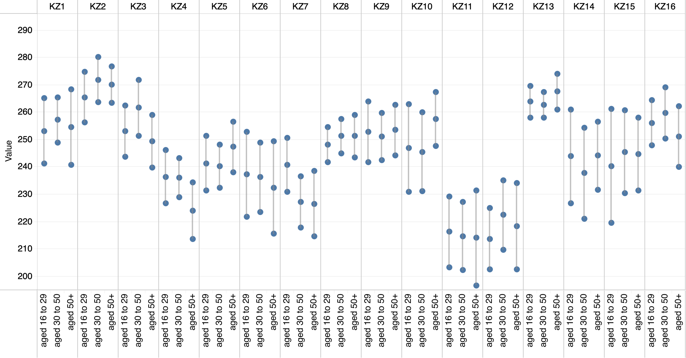
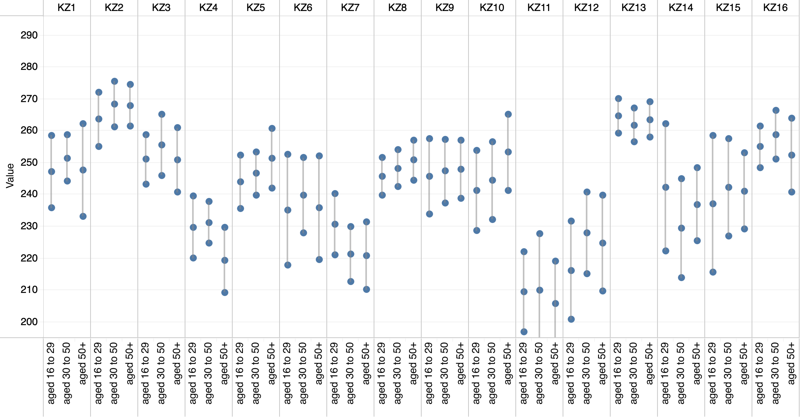
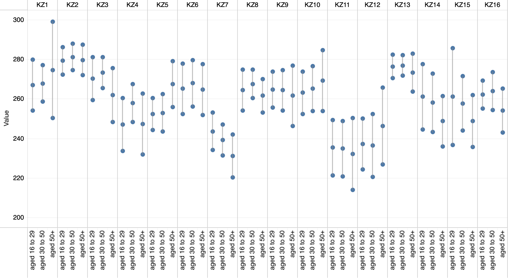
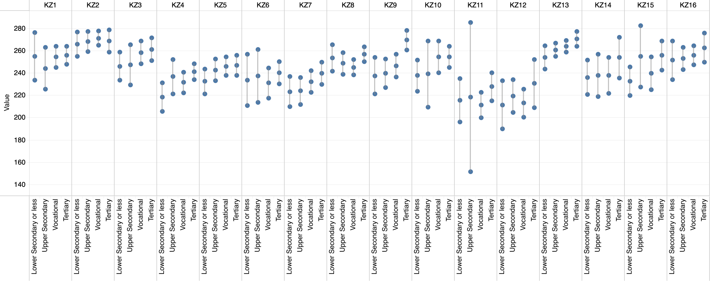
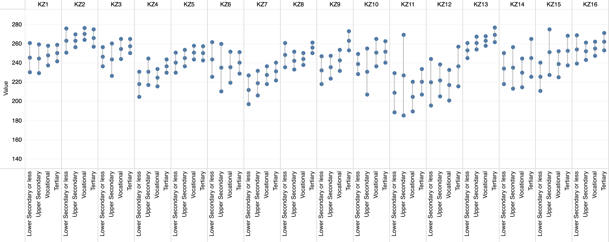
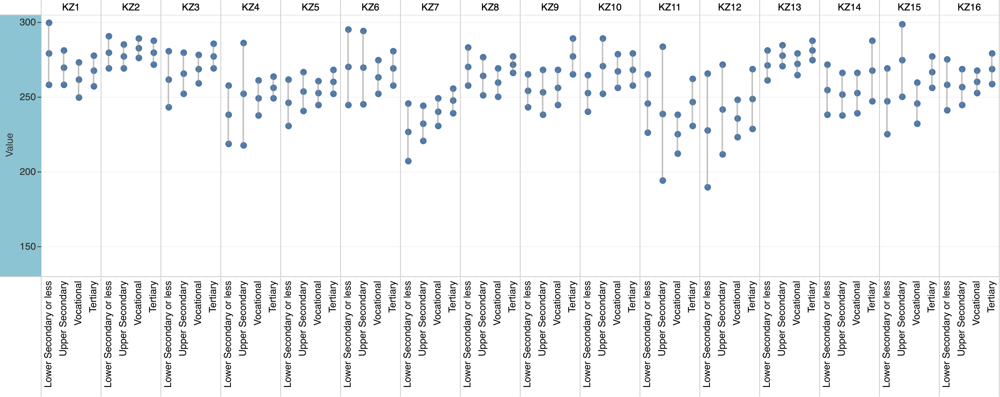
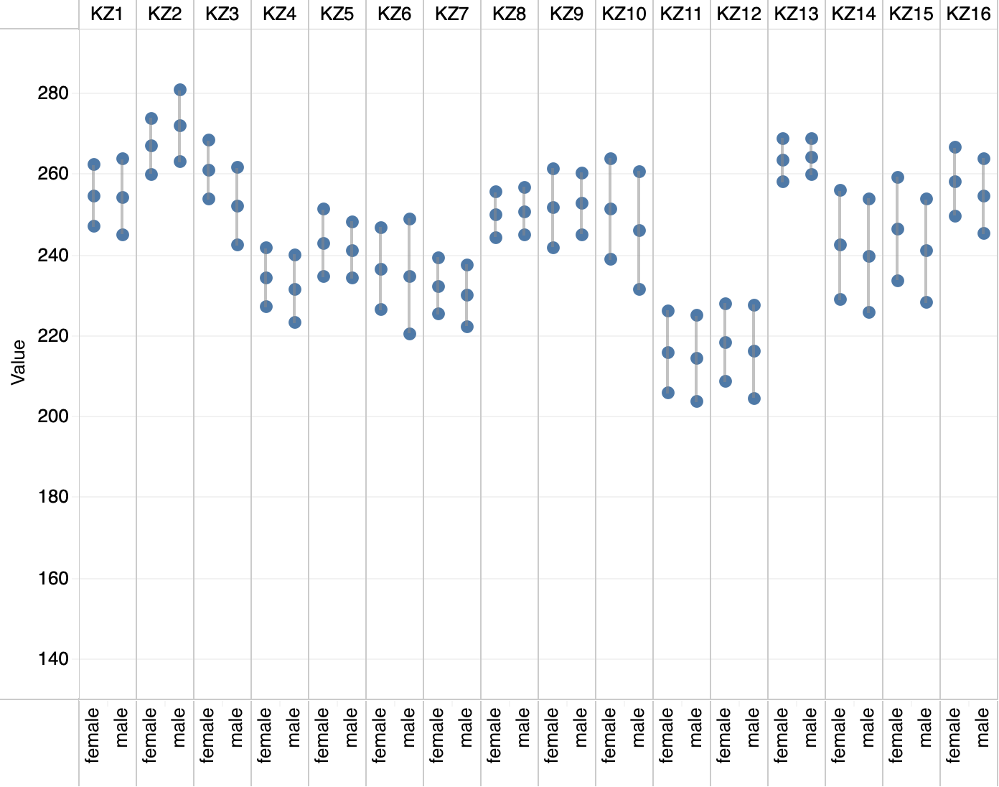
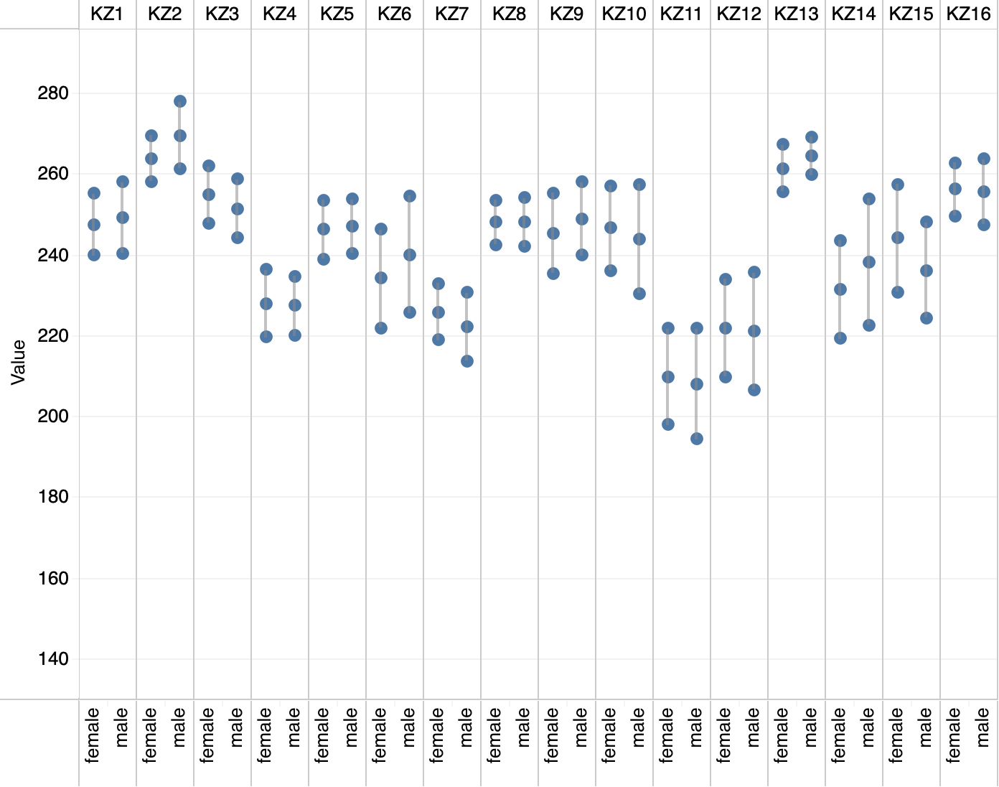
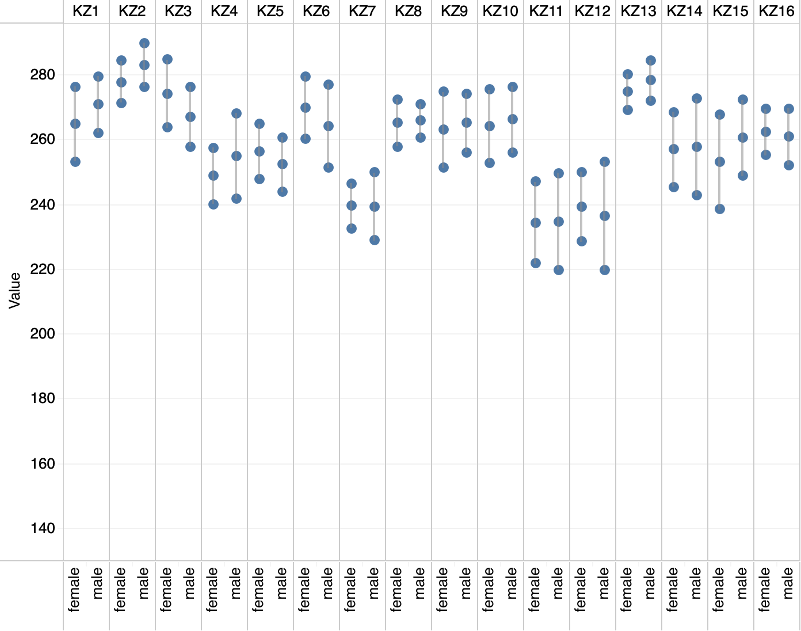

# Summary of the work done up to now for Kazakhstan

## 1. List of do files and  their purpose: 

- KZ_region_refactoring.do: 

- piaac_var_creation_new_countries.do : Creates necessary variables like levels of literacy, numeracy, education, etc. 

- small_database.do: gets together many PIAAC databases so they can be analyzed as part of a set. (same as KZ piaac var creation.do)

- KZ job markets.do: Describes job market variables in relation to gender.

## Results for Literacy, Numeracy and Problem Solving by regions.

The following section summarizes the results for the data description on literacy, numeracy and problem solving skills by region, for 4 different characteristics. 

### Age groups

#### Literacy skills by age groups

#### Numeracy skills by age groups

#### Problem solving skills by age groups

 
 
 
 

### Educational Attainment

#### Literacy skills by educational attainment

#### Numeracy skills by educational attainment

#### Problem solving skills by educational attainment

 
 
 
 

### Gender

#### Literacy skills by gender

#### Numeracy skills by gender

#### Problem solving skills by gender

 
 
 
 

### Indigenous language

#### Literacy skills by gender

#### Numeracy skills by gender

#### Problem solving skills by gender

