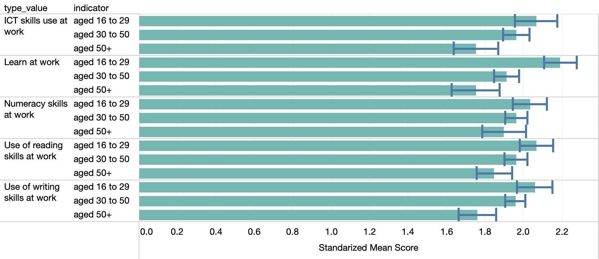
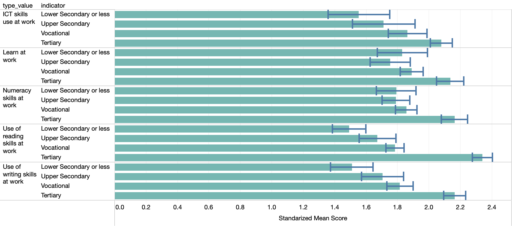
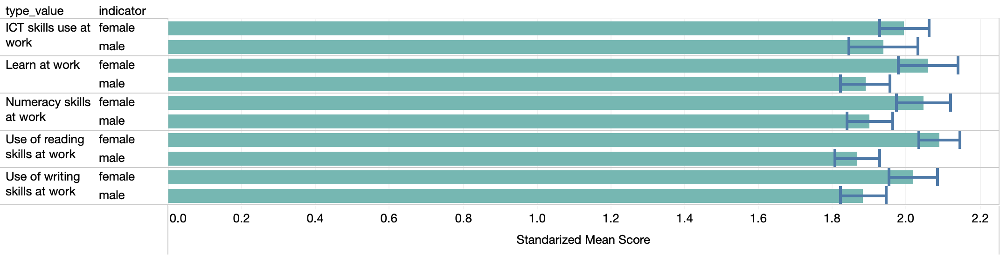
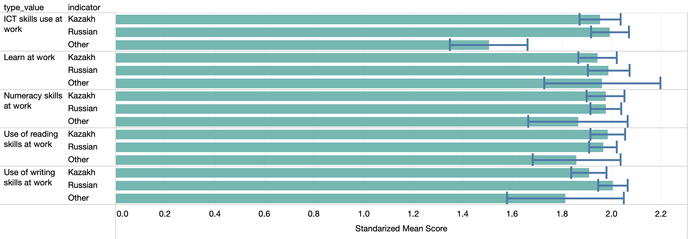
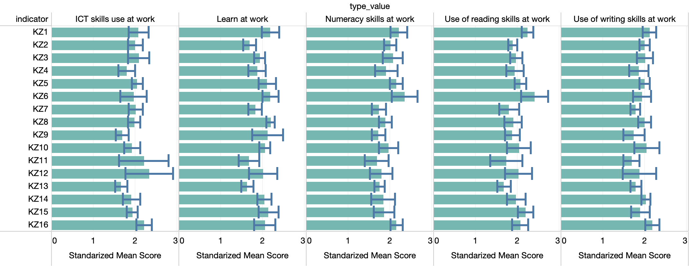

# Skills used at work, by different cuts

This document shows the different sets of skills used at work. The corresponding constructed indexes found on PIAAC are used. The index is normalized at 2. 

The used dofile is called KZ_region_skills

### Skills at work use by age group

### Skills at work use by educational attainment

### Skills at work use by gender

### Skills at work use by language spoken at home

### Skills at work use by regions

